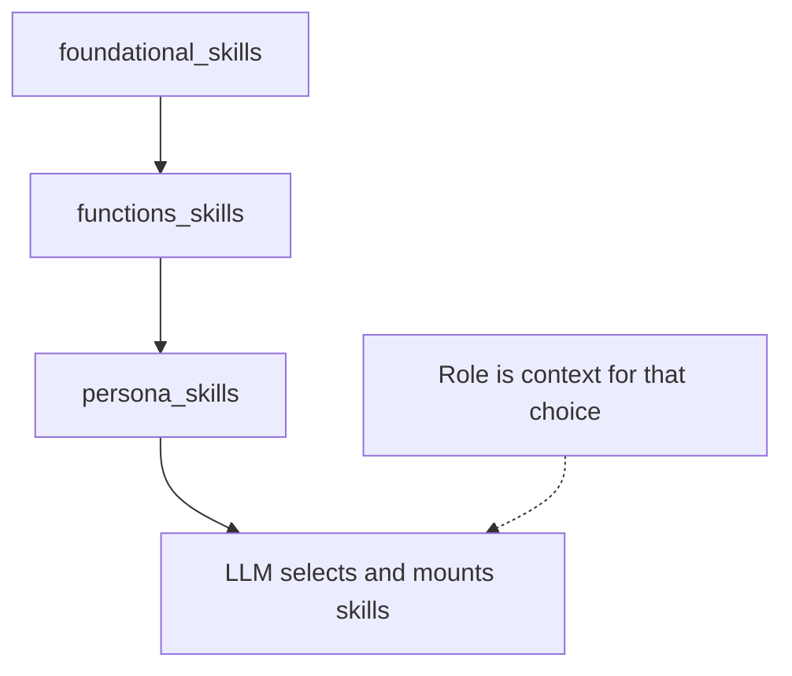
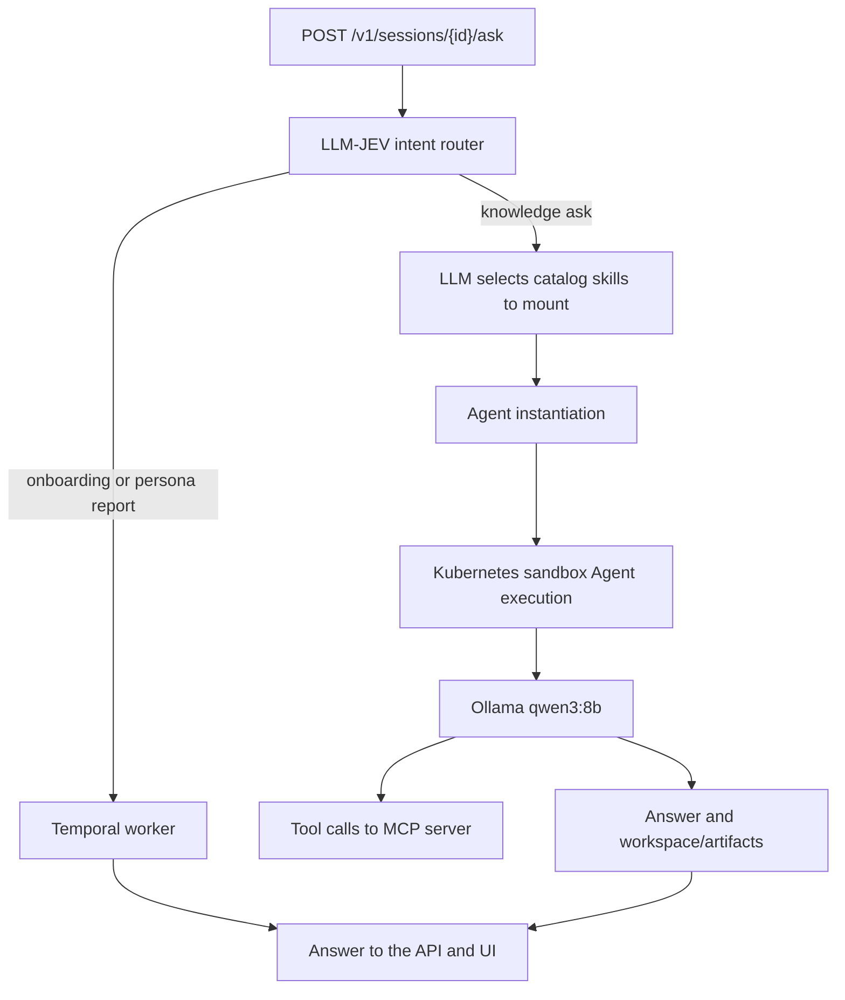
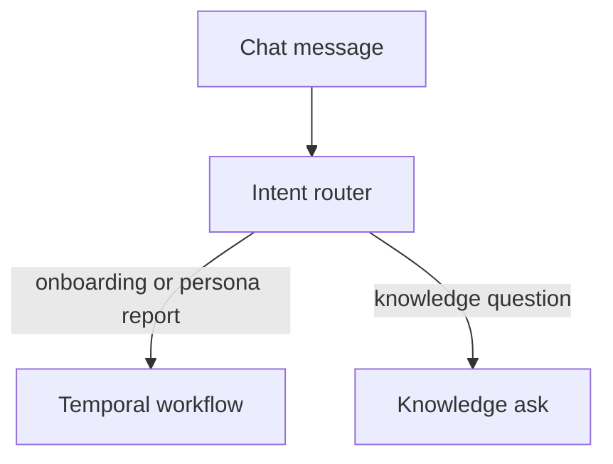

# Knowledge platform

The knowledge platform is one place where a company's leaders and personas like operators, engineers, marketers etc can ask a question and get an answer grounded in the records that actually connect.From scattered operational data to answers in seconds

Ask a question -> Get the answer -> Understand why -> Drill into the evidence.

> The Problem

The information exists. The context doesn't.
Today, answering a seemingly simple question requires jumping between systems.

The problem isn't lack of data.
It's lack of connected context.

> What it does

Someone signs in as a CEO, operations manager, engineer, or marketer and asks in plain language. The platform routes the question, retrieves only the evidence that question needs, and answers from those records, with the figures and the sources in the reply. Follow-up questions are buttons, so the next drill-down is one click.

> Why the answers stay connected

Skills are layered for the role: foundational context, function skills, user skills, then agent skills. The model chooses which of those to mount for the question, and the chosen skill files are what the agent reads. A CEO question can follow company totals down to a market, a warehouse, a part, and an incident. An operations question can follow a van, the job it is on, the missing part, and the warehouse that still has stock. An engineering question can follow a device from telemetry through firmware, a ticket, and a root cause. A marketing question can follow a satisfaction drop to the complaint types and the operational issue behind them.

> How a question runs

The API takes the ask, an LLM routes the intent, and deterministic work such as onboarding and persona reports goes to Temporal. A knowledge question continues into a Kubernetes sandbox with a session filesystem (local disk by default, S3 when configured). The agent does not query the database itself. It calls the knowledge MCP server, whose tools search complaints, documents, issues, incidents, and knowledge and return those rows as evidence. Synthesis is Ollama qwen3:8b. When the question asks for a chart, the model returns the chart and the app draws it.

Knowledge answers are retrieved, then synthesized. Employee onboarding and persona reports run as Temporal workflows. Knowledge asks do not.
### Demo

https://www.loom.com/share/906c44fc53c74d07ab8e7796ad397c55

### Screenshots

> Knowledge Ask


> Deterministic ask directed to temporal workflow


Inspired from : https://stripe.dev/blog/meet-stripes-knowledge-ai-platform

## Quick start

Run these from the repo root, in order. Keep the API, the worker, and the web server in separate terminals.

Prerequisites: Docker, Python 3, Node.js, and `kind` and `kubectl` on `PATH` (`brew install kind kubectl`).

### Install

`docker compose up -d` starts Postgres, Temporal, the Temporal UI on port 8080, Ollama, and openJev. MinIO is not included unless you pass `--profile s3`.

```bash
docker compose up -d
./scripts/ollama-up.sh
./scripts/openjev-up.sh
./scripts/kind-up.sh
python3 -m venv .venv
.venv/bin/pip install -r requirements.txt
```

`./scripts/ollama-up.sh` waits for Ollama and pulls `qwen3:8b` (override with `OLLAMA_MODEL`). `./scripts/openjev-up.sh` waits for `http://127.0.0.1:8081/health`. The first openJev start downloads Laya weights and can take several minutes. Skip that script if you only use the LLM router. `./scripts/kind-up.sh` creates a kind cluster named `knowledge` and writes `$HOME/.kube/kind-knowledge.yaml`.

### Env

```bash
cp .env.example .env
```

The API loads `.env` from the repo root. Variable names are listed under [How to reproduce the demo](#how-to-reproduce-the-demo).

### Seed

Postgres must be up. This creates the four users and loads the support corpus into Postgres. It also writes `data/corpus/`.

```bash
PYTHONPATH=services/platform/src .venv/bin/python -m kp.seed
```

### API

```bash
export KUBECONFIG="$HOME/.kube/kind-knowledge.yaml"
PYTHONPATH=services/platform/src .venv/bin/uvicorn kp.api:app --host 127.0.0.1 --port 8000
```

Knowledge asks return 503 when that kubeconfig is missing. The kind cluster name defaults to `knowledge`.

### Worker

The worker handles onboarding and persona report workflows. It is a separate process from the API.

```bash
PYTHONPATH=services/platform/src .venv/bin/python -m kp.onboarding.worker
```

### Web

```bash
cd apps/web && npm install && npm run dev
```

Open http://localhost:5173. Vite listens on port 5173 and proxies `/v1` to `http://localhost:8000`.

### Checks

```bash
PYTHONPATH=services/platform/src:services/platform .venv/bin/pytest
```

## Tech stack

| Piece | Role |
| --- | --- |
| React 18 and Vite | Chat UI, persona dashboards, Vega charts |
| FastAPI | Auth, sessions, `POST /v1/sessions/{id}/ask`, dashboards |
| Postgres 16 | Users, sessions, and the seeded support corpus |
| Retrieval | The persona function skill loads Postgres rows. Field, engineering, and executive CSVs are added when the question matches. |
| LLM intent router | Default route. An LLM chooses a workflow or a knowledge skill. A knowledge question is then retrieved with that persona's function skill. |
| Skill catalog | Foundational skills, then function, agent, and user skills. `select_skills` asks an LLM which ids to mount. The caller's role is context, not a fixed stack. |
| LangGraph deep agents | Cloud execution model. `create_deep_agent` in `kp.agent.factory`, with a LangGraph `MemorySaver` checkpointer, MCP Postgres tools, mounted skills, and the session filesystem. |
| MCP server `knowledge` | Postgres tools for that deep agent. The API attaches the server in-process. The same server can run over stdio from `services/mcp`. |
| Ollama `qwen3:8b` | Default synthesis in the chat. The Kubernetes sandbox is still provisioned. The answer is one capped completion over the retrieved records. |
| openJev (`laya-1.0` at `127.0.0.1:8081`) | Optional. `router=jev` uses it for intent and for skill selection. If that URL is down, the ask fails. |
| Temporal | Onboarding and persona reports only, after the router chooses a workflow. UI on port 8080. Knowledge asks do not use it. |
| kind cluster `knowledge` | Kubernetes sandbox. Namespace `sess-{session_id}`, claim `claim-{session_id}`, warm pool `warm`, `SandboxTemplate` `kp-sandbox`, runtime class `gvisor`. |
| Session filesystem | `FILESYSTEM=disk` (default) under `data/workspaces`. `FILESYSTEM=s3` uses `S3Backend` at `tenants/{TENANT_ID}/sessions/{session_id}`. `/skills/` stays read-only on local disk. |

### Agent flow

LangGraph deep agents are the execution model for a cloud knowledge ask. `create_session_agent` builds that agent with `create_deep_agent` and a `MemorySaver` checkpointer, then the agent can read and write the mounted session filesystem. The chat default is Ollama `qwen3:8b`: the same sandbox must exist, and synthesis is one capped completion, because the deep-agent tool loop does not finish on that local model before the deadline.

`POST /v1/sessions/{id}/ask` starts in `handle_ask`. The LLM intent router runs first. openJev is optional and only used when the request sets `router=jev`. A workflow route (employee or customer onboarding, or a persona report) is a deterministic Temporal workflow and stops there. A knowledge question is retrieved with the persona function skill: `customer-complaints`, `complaint-drivers`, `complaint-incidents`, or `value-language`. Retrieved rows go into the synthesis prompt.

> Skill Layering

Skills are layered for context in this order: foundational, then functions, then users, then agents. Foundational skills are `base-power-orientation`, `general-research`, `internal-search`, and `data-access`. Function skills are `customer-complaints`, `complaint-drivers`, `complaint-incidents`, and `value-language`. Persona agent skills are `investigation-agent`, `operations-agent`, `engineering-agent`, and `marketing-agent`. `select_skills` asks the LLM which catalog ids to mount for this question. The runtime mounts only the skill ids that call returns. The role is context for that choice, so a skill from another role can be included. Selected skill files are copied into a read-only `/skills/` view.



The writable store is the session filesystem. `FILESYSTEM=disk` is the default and uses local disk under `data/workspaces` (`WORKSPACE_ROOT`). `FILESYSTEM=s3` switches the agent's file tools to `S3Backend` for that session prefix. It is not a volume inside the pod. `K8sSandbox` creates namespace `sess-{session_id}` from `SandboxTemplate` `kp-sandbox` (runtime class `gvisor`, warm pool `warm`). A shell command uploads the local session directory into that pod and copies new files back. Chart output is written under `workspace/artifacts/`. The answer then returns on the ask response.

A cloud knowledge ask builds that deep agent in the API. The chat default still ends at one Ollama `qwen3:8b` completion and does not run the MCP tool loop.



The agent does not query Postgres itself; it calls the knowledge MCP server, which exposes the search and read tools, and the tool results are the data the agent uses. The server runs `search_complaints`, `search_documents`, `search_issues`, `search_incidents`, `search_knowledge`, and `read_resource` against Postgres, and those results come back to the agent as evidence.

### MCP server

The server is named `knowledge`. Tools are registered in `services/platform/src/kp/mcp_tools.py`. `create_session_agent` attaches that server in-process with `MCPAdapter` and passes the tools into `create_deep_agent`. The same server runs over stdio from `services/mcp/src/kp_mcp/server.py` (`python -m kp_mcp`, with the platform package on `PYTHONPATH`). The API does not start that process.

Postgres tools:

| Tool | What the agent uses it for |
| --- | --- |
| `search_complaints` | Find complaints by theme, region, or text. |
| `search_documents` | Find documents by source type, theme, or body text. |
| `search_issues` | Find issues by name, highest complaint count first. |
| `search_incidents` | Find incidents, optionally by technical issue. |
| `search_knowledge` | Find knowledge items, optionally by theme or text. |
| `read_resource` | Open one record by URI, such as `kp://complaints/cmp_001`. Kinds are `documents`, `complaints`, `issues`, `incidents`, and `knowledge_items`. |

The deep agent also gets file and shell tools from the session backend. These are not MCP tools. `/skills/` is read-only.

| Tool | What the agent uses it for |
| --- | --- |
| `ls` | List a directory in the session store or under `/skills/`. |
| `read_file` | Read a session file or a mounted skill file. |
| `write_file` | Write a file in the session store. |
| `edit_file` | Replace text in a session file. |
| `delete` | Delete a session file. |
| `glob` | Find session files by pattern. |
| `grep` | Search session file contents. |
| `execute` | Run a shell command in the Kubernetes sandbox. |
| `task` | Hand a subtask to the general-purpose subagent. |

There is no separate skill tool. Selected skills are copied into `/skills/`, and the agent reads them with `read_file`.

## Temporal workflows

Temporal runs deterministic onboarding and persona reports. A knowledge question does not start a Temporal workflow. The worker command in Quick start listens on task queue `kp-onboarding` and runs every workflow below.



If a field is still missing, the chat keeps the workflow open and answers: `Still need …. Send the missing fields in this chat to continue onboarding.` The next message in that chat fills the gaps.

### Employee onboarding

Workflow name `onboard_employee` (`OnboardEmployee`). It starts on phrases such as "onboard", "onboarding", "new hire", or "new employee", when the message is not a customer or specialist start phrase.

Fields: name, email, and role. Roles are `engineer`, `ceo`, `marketing`, and `operations_manager`. The words "engineering manager" map to `engineer`.

Success: `Onboarded {name} ({email}) as {role}. Directory record {id} was created, the {role} persona was granted, and the manager was notified.`

### Customer onboarding

Workflow name `onboard_customer` (`OnboardCustomer`). It starts on phrases such as "onboard customer" or "customer onboarding".

Fields: name, email, city, and system type. System types are whole-home battery, commercial storage, and backup.

Success: `Onboarded {name} ({email}) in {city} with {system type}.`

### Specialist onboarding

`OnboardSpecialist` is one Temporal workflow. The start phrase sets `kind`, and that kind picks the fields. These are not the employee workflow. Saying "onboard engineer" or "onboard operations manager" starts a specialist flow. Saying "onboard employee" and then a role of engineer or operations manager stays on employee onboarding.

| Kind | Start phrases | Fields | Success |
| --- | --- | --- | --- |
| Field technician / electrician (`field_technician`) | "onboard field technician", "onboard electrician", "field technician onboard", "electrician onboard" | name, email, trade (`electrician` or `field technician`), home city | `Onboarded {name} ({email}) as {trade} in {home city}.` |
| Installer partner / contractor (`installer_partner`) | "onboard installer partner", "onboard contractor", "installer partner onboard", "contractor onboard" | company name, contact name, email, city | `Onboarded installer partner {company} ({email}) in {city}, contact {contact name}.` |
| Warehouse associate (`warehouse_associate`) | "onboard warehouse associate", "warehouse associate onboard" | name, email, warehouse city, shift (`day` or `night`) | `Onboarded {name} ({email}) as warehouse associate in {warehouse city} on the {shift} shift.` |
| Engineer (`engineer`) | "onboard engineer", "engineer onboard" | name, email, specialty (`battery`, `inverter`, `firmware`, or `thermal`) | `Onboarded {name} ({email}) as engineer, specialty {specialty}.` |
| Operations manager (`operations_manager`) | "onboard operations manager", "operations manager onboard" | name, email, region (a Texas city the parser knows, or "central Texas") | `Onboarded {name} ({email}) as operations manager for {region}.` |
| New market / warehouse launch (`warehouse_launch`) | "onboard new market", "warehouse launch", "onboard warehouse launch" | market city, warehouse name, launch date, manager email | `Onboarded warehouse {warehouse name} in {market city}, launch {date}, manager {email}.` |

The specialist engineer specialty is not the employee role word "engineer".

### Persona reports

A report runs only for the signed-in persona that owns it. It takes no fields and reads the corpus. Another persona's phrase stays a knowledge ask.

| Persona | Workflow | Start phrases | Answer opens with |
| --- | --- | --- | --- |
| CEO | `issue_trend_report` | "issue trend", "issue trend report", "trend report" | `Issue trend report, ordered by complaint count:` |
| CEO | `severity_digest` | "severity digest", "issues by severity", "severity report" | `Severity digest:` |
| Operations manager | `blocker_ranking` | "blocker ranking", "rank blockers" | `Blocker ranking, in counted order:` |
| Operations manager | `installation_risk_report` | "installation risk", "at-risk installations", "delayed installations", "open operational incidents" | `Installation risk report:` |
| Engineer | `technical_issue_counts` | "technical issue counts" | `Technical issue counts:` |
| Engineer | `related_incident_report` | "related incident", "related incident report", "incidents ordered by" | `Related incidents, ordered by linked complaints:` |
| Marketing | `sentiment_breakdown` | "sentiment breakdown", "sentiment report", "positive, neutral, and negative" | `Sentiment breakdown:` |
| Marketing | `value_theme_counts` | "value theme counts", "energy independence, installation experience, and battery reliability" | `Value theme counts:` |

## How to reproduce the demo

Copy `.env.example` to `.env`. Do not commit `.env`. Names below are the ones in `.env.example`.

Local Ollama does not need a cloud key. Leave `LLM_API_KEY` empty and keep:

- `LLM_PROVIDER=ollama`
- `OLLAMA_BASE_URL=http://127.0.0.1:11434/v1`
- `OLLAMA_MODEL=qwen3:8b`

A cloud model needs `LLM_API_KEY`. `LLM_MODEL` defaults to `gpt-4o-mini`. Set `LLM_BASE_URL` when the provider is not the default OpenAI host. The chat sends `provider: ollama` on each ask, so a cloud key is unused until the UI or the request selects a cloud model.

The JEV router calls `JEV_BASE_URL` (`http://127.0.0.1:8081`) with `JEV_MODEL=laya-1.0`. `JEV_API_KEY` is optional and is sent only when the openJev container sets `OPENJEV_API_KEY`. Host port 8081 leaves the Temporal UI on 8080. Inside Compose, the openJev process listens on 8080.

Other variables in `.env.example`:

| Variable | Local demo |
| --- | --- |
| `DATABASE_URL` | `postgresql+psycopg://kp:kp@localhost:5432/knowledge` |
| `TEMPORAL_ADDRESS` | `localhost:7233` |
| `TEMPORAL_NAMESPACE` | `default` |
| `ONBOARDING_RUNNER` | `temporal` |
| `FILESYSTEM` | `disk`. `s3` refuses to start if `S3_BUCKET` is missing or the bucket cannot be reached. |
| `S3_BUCKET`, `S3_ENDPOINT_URL`, `S3_ACCESS_KEY`, `S3_SECRET_KEY`, `S3_REGION` | Only for `docker compose --profile s3 up`. |
| `SANDBOX_RUNTIME_CLASS` | `gvisor` |
| `KUBECONFIG` | Empty in the example. Export `$HOME/.kube/kind-knowledge.yaml` before the API, as in Quick start. If unset, the API uses that file when it exists. |
| `KIND_CLUSTER` | `knowledge` |
| `CORS_ORIGINS` | `http://localhost:5173,http://127.0.0.1:5173` |
| `COOKIE_SECURE` | `false` for local http |
| `TENANT_ID` | `base` |

Seeded logins (passwords are stored as bcrypt hashes):

| Username | Password |
| --- | --- |
| `ceo` | `base-ceo-local` |
| `operations_manager` | `base-ops-local` |
| `engineer` | `base-eng-local` |
| `marketing` | `base-mkt-local` |

The chat defaults to the LLM router and `qwen3:8b`. Switch the router control to JEV only after openJev is healthy.

## Datasets

All data in this repo is synthetic. There are no real people, customers, addresses, financials, or credentials.

### Support corpus

`python -m kp.seed` generates the original knowledge corpus and loads it into Postgres. The same run writes JSON under `data/corpus/`: conversations, operations tickets, incidents, documents, company performance, revenue, a sample ERCOT series, warehouse inventory notes, and customer outages. Complaint themes, company performance, and outages in that corpus are the seeded Postgres records. Field, engineering, and executive CSVs are not loaded by the seed.

### Field operations

`data/*.csv` is a fictional Lumenfield Energy field-service snapshot for Central Texas. Clock is 2026-09-27 16:00 America/Chicago. Files cover technicians, vans, warehouses, jobs, parts, schedules, and alerts. No real people or street addresses. The generator does not touch `data/corpus/`.

```bash
python3 scripts/generate_field_ops.py
```

Column notes and demo questions are in `data/README.md`.

### Engineering

`data/engineering/` is the engineer persona pack: devices, components, faults, telemetry samples, firmware, incidents, tickets, and alerts. Snapshot time is 2026-09-27T16:00:00-05:00.

```bash
python3 scripts/generate_engineering_data.py
```

See `data/engineering/README.md`.

### Executive

`data/executive/` is the CEO pack: markets, deployment, workforce, inventory risk, engineering health, and company metrics. Snapshot date is 2026-09-27. It reuses warehouse, technician, part, job, and engineering ids from the other synthetic files so the packs can be joined. `company_metrics` for 2026-04 through 2026-09 is the sum of the market rows. Staffing and inventory can both be short in the same window. The tables record that coincidence. They do not name one of them as the primary cause of a decline.

```bash
python3 scripts/generate_executive_data.py
```

The script uses the Python standard library and `random.seed(27)`. See `data/executive/README.md`.

## Known limitations and next steps

Charts are produced by the local model from the rows it was given.
Answers depend on Ollama `qwen3:8b`. A long chart answer can be slow. If the JSON is cut off, the answer or the chart can be incomplete.

The sandbox requires the kind cluster and `KUBECONFIG`. There is no local subprocess fallback.

Next steps: store executive metrics in Postgres instead of reading the CSVs on every ask, and tighten chart grounding so plotted points are taken from the retrieved rows.
